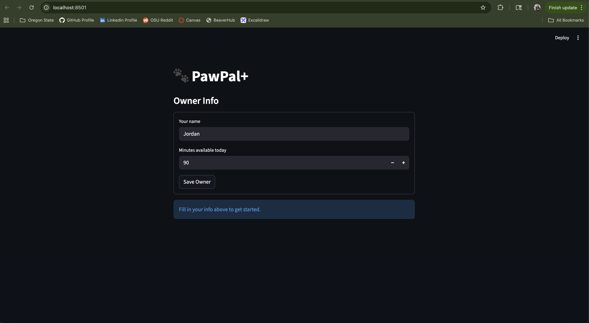

# PawPal+ (Module 2 Project)

You are building **PawPal+**, a Streamlit app that helps a pet owner plan care tasks for their pet.

## Scenario

A busy pet owner needs help staying consistent with pet care. They want an assistant that can:

- Track pet care tasks (walks, feeding, meds, enrichment, grooming, etc.)
- Consider constraints (time available, priority, owner preferences)
- Produce a daily plan and explain why it chose that plan

Your job is to design the system first (UML), then implement the logic in Python, then connect it to the Streamlit UI.

## What you will build

Your final app should:

- Let a user enter basic owner + pet info
- Let a user add/edit tasks (duration + priority at minimum)
- Generate a daily schedule/plan based on constraints and priorities
- Display the plan clearly (and ideally explain the reasoning)
- Include tests for the most important scheduling behaviors

## Getting started

### Setup

```bash
python -m venv .venv
source .venv/bin/activate  # Windows: .venv\Scripts\activate
pip install -r requirements.txt
```

## Testing PawPal+

Run the test suite from the project root:

```bash
python -m pytest
```

The suite covers 10 tests across three areas:

- **Core behavior** — marking a task complete flips its status; adding a task to a pet increases the task count
- **Sorting** — tasks are returned in chronological order by `preferred_time`; tasks with no time set fall to the end
- **Recurrence** — completing a `"daily"` task creates a new one due tomorrow; `"once"` tasks return nothing; the new task lands on the correct pet
- **Conflict detection** — overlapping time windows are flagged; adjacent tasks (back-to-back) are not; tasks with no time set never cause false warnings

**Confidence level: ★★★★☆**
The core scheduling logic and all new features are well covered. The remaining gap is end-to-end UI testing — the Streamlit layer is not tested, so edge cases around user input (empty forms, duplicate pet names) are untested.

---

## Smarter Scheduling

Beyond basic priority sorting, the scheduler includes three additional features:

- **Sort by time** — `sort_by_time()` orders tasks by their `preferred_time` (HH:MM) so the day reads chronologically. Tasks with no time set fall to the end.
- **Filter tasks** — `filter_tasks()` lets you query by completion status, pet name, or both. Useful for showing only what's left to do or inspecting one pet's workload.
- **Conflict detection** — `detect_conflicts()` checks whether any scheduled tasks have overlapping time windows and returns plain-text warnings. It never crashes — if two tasks collide, you get a message explaining which ones and why.
- **Recurring tasks** — Tasks have a `frequency` field (`"once"`, `"daily"`, `"weekly"`). Calling `complete_task()` marks the task done and automatically creates the next occurrence with a due date calculated using `timedelta`.

---

## 📸 Demo

<a href="image.png" target="_blank"></a>

---

## Features

- **Priority-based scheduling** — Tasks are sorted high → medium → low. Ties are broken by duration so shorter tasks go first and more fits in the budget.
- **Time budget enforcement** — The owner sets available minutes for the day; the scheduler fills that budget and reports what was skipped and why.
- **Sorting by time of day** — `sort_by_time()` orders tasks by `preferred_time` (HH:MM) so the plan reads chronologically from morning to evening.
- **Conflict warnings** — `detect_conflicts()` checks every pair of scheduled tasks for overlapping time windows and surfaces warnings in the UI — no crash, just a clear heads-up.
- **Daily and weekly recurrence** — `complete_task()` marks a task done and automatically creates the next occurrence using Python's `timedelta` (`+1 day` for daily, `+7 days` for weekly).
- **Task filtering** — `filter_tasks()` queries tasks by completion status, pet name, or both — useful for showing only pending items or one pet's workload.
- **Multi-pet support** — Multiple pets can be registered under one owner; the scheduler pulls tasks across all of them into a single daily plan.

---

### Suggested workflow

1. Read the scenario carefully and identify requirements and edge cases.
2. Draft a UML diagram (classes, attributes, methods, relationships).
3. Convert UML into Python class stubs (no logic yet).
4. Implement scheduling logic in small increments.
5. Add tests to verify key behaviors.
6. Connect your logic to the Streamlit UI in `app.py`.
7. Refine UML so it matches what you actually built.
